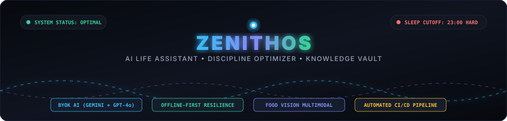
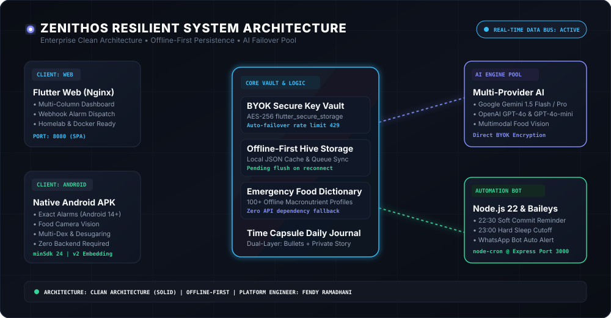
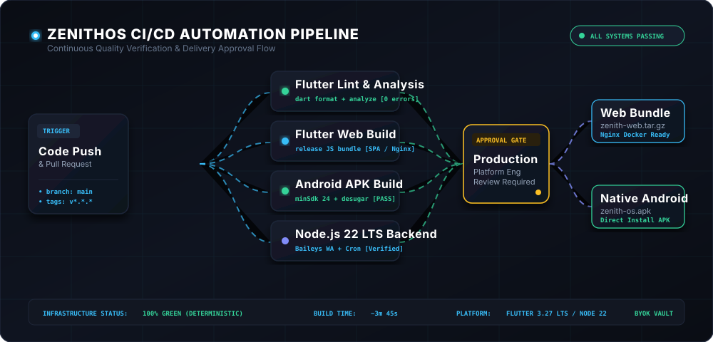
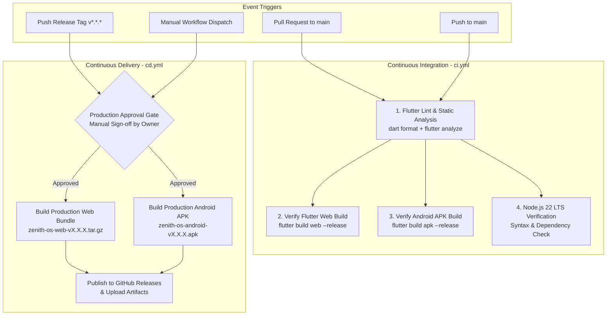

<div align="center">



<br/>

[](./LICENSE)
[](https://flutter.dev)
[](https://www.docker.com)
[](#)
[](https://aistudio.google.com)
[](https://github.com/fendyramadhani9-cloud/ZenithOS-AI-Life-Assistant-Discipline-Optimizer/actions)

**ZenithOS** is an enterprise-grade, offline-first personal assistant, daily discipline optimizer, and resilient knowledge vault built with Flutter (Dart) and Node.js. It features a responsive Cyber-Obsidian UI tailored for both Desktop Web and Native Android Mobile.

</div>

---

## 1. Strict Design System & Iconography Rules

- **Strict Zero-Emoji Policy**: No keyboard emojis in navigation, buttons, metrics, or status badges. All visual indicators strictly use vector icons from `lucide_icons_flutter` (e.g., `LucideIcons.terminal`, `LucideIcons.calendar`, `LucideIcons.camera`, `LucideIcons.droplets`, `LucideIcons.keyRound`, `LucideIcons.shieldCheck`, `LucideIcons.lock`, `LucideIcons.share2`).
- **Cyber-Obsidian Minimalist Palette (OLED Friendly)**:
  - **Background**: `#0A0D14` (Deep Obsidian Void)
  - **Card Surface**: `#121722` with border `Border.all(color: Color(0xFF1E2638), width: 1)`
  - **Primary Accents**: `#38BDF8` (Electric Sky Blue) & `#818CF8` (Soft Indigo)
  - **Hydration Accent**: `#0EA5E9` (Deep Cyan Blue)
  - **Nutrition & Success**: `#34D399` (Emerald Mint)
  - **Strict Cut-off / Danger**: `#F87171` (Crimson Coral)
  - **Typography**: `GoogleFonts.inter()` for UI/Body and `GoogleFonts.jetBrainsMono()` for metrics, timestamps, calories, and masked keys.

---

## 2. Core Pillars & System Architecture

<div align="center">
  
</div>

<br/>

### A. Multi-Provider AI Engine with Auto-Failover (BYOK)
- Supports **Google Gemini** (`gemini-1.5-flash`, `gemini-1.5-pro`) and **OpenAI GPT** (`gpt-4o-mini`, `gpt-4o`).
- Encrypted local key storage via `flutter_secure_storage`.
- Key Pool with automatic failover rotation on `429 (Rate Limit)` or `5xx` errors.

### B. Offline-First Resilience & Emergency Nutrition Dictionary
- `OfflineQueueService` saves requests to Hive with `pending_sync` status during network disconnects and auto-flushes upon reconnection.
- Built-in `EmergencyNutritionDictionary` containing 100+ common foods (Nasi, Telur, Dada Ayam, Tempe, Tahu, Salmon, Oat) for instant macronutrient estimation when offline.

### C. Multi-Platform Alarm Service
- **Web / Desktop**: Dispatches webhook requests to `http://localhost:3000/api/alarm` to trigger WhatsApp Desktop bot reminders.
- **Android APK**: Native exact full-screen alarms using the `alarm` package with core library desugaring and multi-dex support.
- **Mandatory Sleep Cutoffs**:
  - `22:30`: Soft Reminder (Commit code, wrap up IaC, close IDE).
  - `23:00`: Hard Bedtime Alarm (6-hour cellular recovery window until 05:00 wake).

### D. Dual-Layer Time Capsule (Daily Log)
- **Layer 1 (Quick Bullets)**: Interactive to-do checklist.
- **Layer 2 (The Unfiltered Story)**: Long-form unrestricted reflections.
- **Privacy Toggle**: Instant toggle between `[Private Only]` and `[Partner Shared]`.

### E. Smart Food Vision & Weight Cut Tracker
- Multimodal plate analysis calculating Calories, Protein, Carbs, and Fats.
- Visual macro ring progress bar for the **70 kg $\rightarrow$ 64 kg** weight cut goal.

### F. Water & Hydration Tracker
- Quick counter buttons (`+250 ml` & `+500 ml`) with daily 2,500 ml target visualizer.

### G. Local JSON Backup & Restore
- Instant export and import of `zenith_backup_[timestamp].json`.

---

## 3. CI/CD Architecture & Pipeline Workflow

<div align="center">
  
</div>

<br/>



### Tahapan CI/CD Detail:

#### 1. Continuous Integration (`.github/workflows/ci.yml`)
- **Pemicu**: Setiap Pull Request (PR) atau Push langsung ke branch `main`.
- **Eksekusi Paralel & Bertahap**:
  1. **Static Analysis & Formatting**: Menjalankan `dart format .` dan `flutter analyze --no-fatal-infos` dengan rule strict zero-error.
  2. **Flutter Web Build Verification**: Memastikan kompilasi Web JavaScript (`build/web`) bebas dari error platform.
  3. **Android APK Build Verification**: Memvalidasi build APK rilis Android dengan Gradle 8.4 dan `minSdk 24`.
  4. **Backend Automation Verification**: Memverifikasi sintaks Node.js 22 LTS dan integrasi bot WhatsApp Baileys.
- **Tujuan**: Mencegah regresi kode dan memvalidasi kontribusi inovasi/bugfix secara otomatis sebelum masuk ke branch produksi.

#### 2. Continuous Delivery dengan Approval Gate (`.github/workflows/cd.yml`)
- **Pemicu**: Pembuatan tag rilis (contoh: `v1.0.0`) atau pemicu manual (*Workflow Dispatch*).
- **Security Approval Gate**: Menggunakan environment GitHub `production` dengan proteksi *Required Reviewers*. Rilis tidak akan diproses tanpa persetujuan eksplisit dari Platform Engineer / Owner.
- **Artefak Output**:
  - `zenith-os-android-vX.X.X.apk` (Instalasi native Android tanpa ketergantungan server luar).
  - `zenith-os-web-vX.X.X.tar.gz` (Web bundle untuk Nginx/Docker homelab).
  - Integrasi otomatis ke halaman **GitHub Releases** dengan catatan rilis (*changelog*).

---

## 4. Project Structure

```
.
├── .github/
│   └── workflows/
│       ├── ci.yml                         # Continuous Integration (Lint, Web, Android, Backend)
│       └── cd.yml                         # Continuous Delivery with Production Approval Gate
├── android/
│   ├── app/
│   │   ├── build.gradle                   # Groovy DSL, minSdk 24, desugaring, multidex
│   │   └── src/main/AndroidManifest.xml   # Android permissions & alarms
│   ├── build.gradle                       # Root Gradle config
│   ├── settings.gradle                    # Declarative Flutter plugin loader
│   └── gradle.properties                  # Optimized JVM args & AndroidX flags
├── backend/
│   ├── Dockerfile                         # Node.js 22 Alpine container
│   ├── package.json                       # Express, @whiskeysockets/baileys, node-cron
│   └── src/
│       ├── index.js                       # Webhook listener & cron scheduler
│       └── wa_client.js                   # Baileys WhatsApp bot client
├── docs/
│   └── assets/                            # Animated SVG diagrams & interactive visualizers
├── frontend/
│   ├── Dockerfile                         # Multi-stage Flutter SDK -> Nginx Alpine
│   └── nginx.conf                         # Reverse proxy and SPA routing
├── docker-compose.yml                     # Multi-container orchestration
├── pubspec.yaml                           # Flutter dependencies (lucide_icons_flutter)
├── analysis_options.yaml                  # Flutter linter configuration
└── lib/
    ├── core/
    │   ├── constants/ (app_colors.dart, app_typography.dart, app_theme.dart)
    │   ├── network_queue/ (emergency_nutrition_dictionary.dart, offline_queue_service.dart)
    │   ├── storage/ (storage_service.dart)
    │   └── utils/ (backup_service.dart, responsive_layout.dart)
    ├── services/
    │   ├── ai/ (ai_service.dart, gemini_service.dart, openai_service.dart, key_vault_controller.dart, ai_factory.dart)
    │   └── alarm/ (alarm_service.dart, web_alarm_service.dart, mobile_alarm_service.dart, alarm_factory.dart)
    ├── features/
    │   ├── onboarding/ (onboarding_auth_screen.dart)
    │   ├── dashboard/ (main_dashboard_screen.dart, desktop_sidebar.dart, mobile_bottom_nav.dart)
    │   ├── scheduler/ (ai_scheduler_widget.dart, schedule_timeline_widget.dart, scheduler_ai_service.dart)
    │   ├── food_vision/ (food_vision_card.dart, macro_ring_widget.dart, food_vision_service.dart)
    │   ├── journal/ (dual_layer_journal_widget.dart, journal_entry.dart)
    │   ├── hydration/ (hydration_tracker_widget.dart)
    │   ├── retrospective/ (weekly_retrospective_modal.dart)
    │   └── settings/ (key_vault_screen.dart)
    └── main.dart
```

---

## 5. Deployment & Quick Start Guide

### Option 1: Running Web Version via Docker (Desktop & Homelab)

1. Clone repository and navigate to root directory:
   ```bash
   git clone https://github.com/fendyramadhani9-cloud/ZenithOS-AI-Life-Assistant-Discipline-Optimizer.git
   cd ZenithOS-AI-Life-Assistant-Discipline-Optimizer
   ```

2. Start containers via Docker Compose:
   ```bash
   docker compose up -d
   ```

3. Open your browser:
   - **Frontend UI**: [http://localhost:8080](http://localhost:8080)
   - **Backend Status**: [http://localhost:3000/api/status](http://localhost:3000/api/status)

4. **Pair WhatsApp Bot (Optional for Webhook Alarms)**:
   - View backend terminal logs to scan the pairing QR code:
     ```bash
     docker logs -f zenith_backend
     ```
   - Scan with WhatsApp on your phone (`Linked Devices`). Authentication state persists in `./backend/auth_info`.

---

### Option 2: Standalone Native Android APK Installation

1. **Build Release APK**:
   ```bash
   flutter build apk --release
   ```
2. **Install APK**: Transfer file `build/app/outputs/flutter-apk/app-release.apk` ke HP Android Anda lalu lakukan instalasi.
3. **Buka Aplikasi ZenithOS**: Pada layar pertama (*Onboarding*), Anda akan diminta memasukkan API Key Anda sendiri (**Zero Backend Required** — HP Anda langsung berkomunikasi secara terenkripsi ke endpoint AI).

#### 🔑 Cara Mendapatkan API Key Google Gemini (100% Gratis):
1. Buka browser dan kunjungi **[Google AI Studio](https://aistudio.google.com/)**.
2. Login menggunakan akun Google Anda.
3. Klik tombol **"Get API key"** di sidebar kiri atau pojok kanan atas.
4. Klik **"Create API key"** $\rightarrow$ Pilih project Google Cloud yang ada atau pilih *"Create API key in new project"*.
5. Salin (*copy*) string kunci API yang dihasilkan (berawalan `AIzaSy...`).
6. Buka aplikasi **ZenithOS** di HP Anda:
   - Pilih Provider: **Google Gemini**.
   - Tempel (*paste*) API Key pada kolom yang disediakan.
   - Klik tombol **"Test Connection"** untuk memvalidasi kunci.
   - Klik **"Initialize ZenithOS"** untuk mulai menggunakan asisten AI!

> [!TIP]
> **Key Failover (Opsional)**: Anda dapat membuat lebih dari satu API Key di Google AI Studio lalu menambahkannya ke menu **Key Vault & Backup** di ZenithOS. Jika satu key terkena limit harian (*rate limit 429*), ZenithOS akan otomatis merotasi ke key cadangan berikutnya tanpa memutus interaksi.

*(Alternatif: Jika ingin menggunakan OpenAI GPT-4o, Anda bisa mendapatkan API Key dari [platform.openai.com/api-keys](https://platform.openai.com/api-keys)).*

---

## 6. Development & Local Debugging

- **Run Flutter locally**:
  ```bash
  flutter pub get
  flutter run -d chrome     # Run on Chrome
  flutter run -d android    # Run on connected Android device
  ```
- **Run Backend locally**:
  ```bash
  cd backend
  npm install
  npm start
  ```

---

## 📄 License

This project is licensed under the **MIT License** — see the [LICENSE](./LICENSE) file for full details.

```text
MIT License
Copyright (c) 2026 Fendy Ramadhani <fendyramadhani9@gmail.com>

Permission is hereby granted, free of charge, to any person obtaining a copy
of this software and associated documentation files (the "Software"), to deal
in the Software without restriction...
```

---

## 👨‍💻 Platform Engineer & Creator

<div align="center">

### **Fendy Ramadhani**
*Platform Engineer | Cloud & AI Systems Infrastructure*

[](https://github.com/fendyramadhani9-cloud)
[](https://www.linkedin.com/in/fendy-ramadhani9/)
[](https://medium.com/@FendyRamadhani)
[](mailto:fendyramadhani9@gmail.com)

</div>

> *"Discipline equals freedom. Automate the routine, optimize recovery, and build with resilient infrastructure."*

---

<div align="center">
  <sub>Built with high discipline for high performers. © 2026 <b>ZenithOS</b> by <b>Fendy Ramadhani</b>.</sub>
</div>
